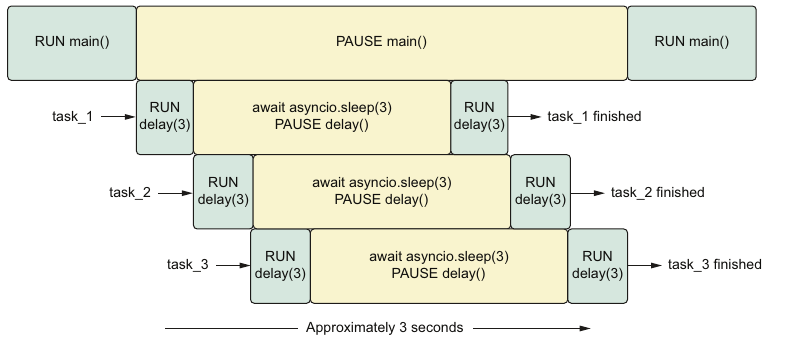

# Python Concurrency with aasyncio

## Chapter1 Getting to know asyncio

## Chapter2 asyncio basics

`Running a coroutine`

asyncio.run is doing a few important things in this scenario. First, it creates a brand-new event. Once it successfully does so, it takes whichever coroutine we pass into it and runs it until it completes, returning the result. This function will also do some cleanup of anything that might be left running after the main coroutine finishes. Once everything has finished, it shuts down and closes the event loop.

```python
import asyncio

async def add_one(number: int) -> int:
    return number + 1

async def main() -> None:
    # await 其实就是在调用 async func
    # 会等add_one(1)执行完才会执行回复，也就是会pause main()
    one_plus_one = await add_one(1)
    two_plus_one = await add_one(2)
    print(one_plus_one)
    print(two_plus_one)

asyncio.run(main())
```

`Running concurrently with tasks`



```python
import asyncio

async def delay(delay_seconds: int) -> int:
    print(f'sleeping for {delay_seconds} second(s)')
    await asyncio.sleep(delay_seconds)
    print(f'finished sleeping for {delay_seconds} second(s)')
    return delay_seconds

async def main():
    # Tasks are wrappers around a coroutine that schedule
    # a coroutine to run on the event loop as soon as possible
    sleep_for_three = asyncio.create_task(delay(3))
    sleep_again = asyncio.create_task(delay(4))
    sleep_once_more = asyncio.create_task(delay(5))

    await sleep_for_three
    # if we didn't use await, out task would be scheduled to run,
    # but it would almost immediately be stopped and cleaned up when
    # asyncio.run shut down the even loop
    # 如果comment下面的await结果如下：
    '''
    sleeping for 3 second(s)
    sleeping for 4 second(s)
    sleeping for 5 second(s)
    finished sleeping for 3 second(s)

    Process finished with exit code 0
    '''
    await sleep_again
    await sleep_once_more

asyncio.run(main())
```