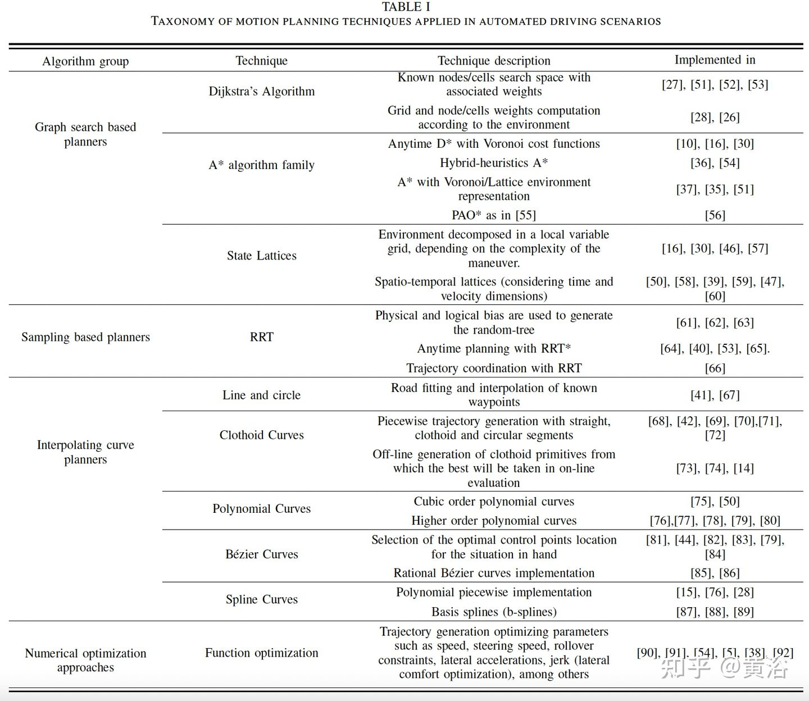
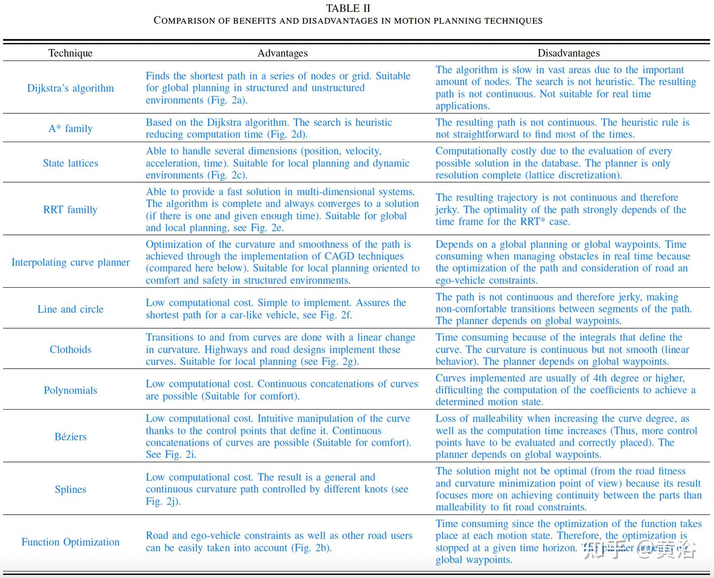
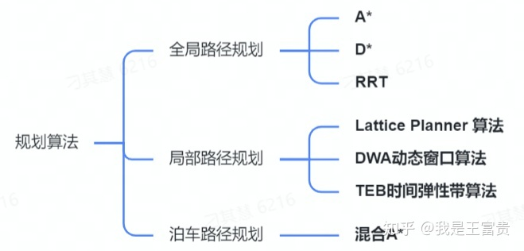

# Motion Planning

## 常见算法

+ Dijkstra’s algorithm. If the heuristic cost-to-go is always estimated as zero then A ∗ always explores from the OPEN node that has been reached with minimum past cost. This variant is called Dijkstra’s algorithm, which preceded A ∗ historically. Dijkstra’s algorithm is also guaranteed to find a minimum-cost path but on many problems it runs more slowly than A ∗ owing to the lack of a heuristic look-ahead function to help guide the search.

+ Breadth-first search. If each edge in E has the same cost, Dijkstra’s algorithm reduces to breadth-first search. All nodes one edge away from the start node are considered first, then all nodes two edges away, etc. The first solution found is therefore a minimum-cost path.

## 自动驾驶

